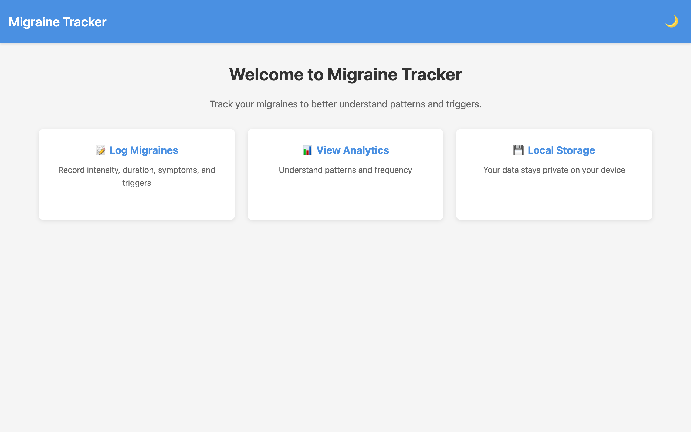
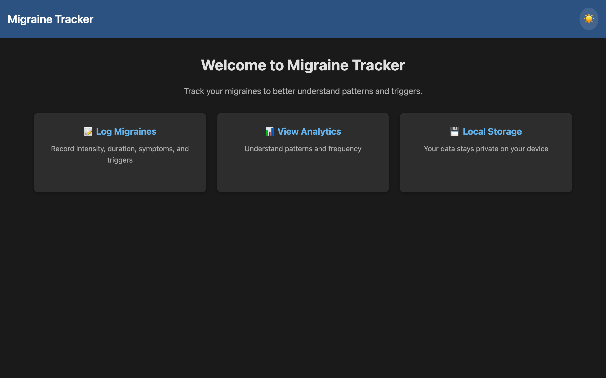
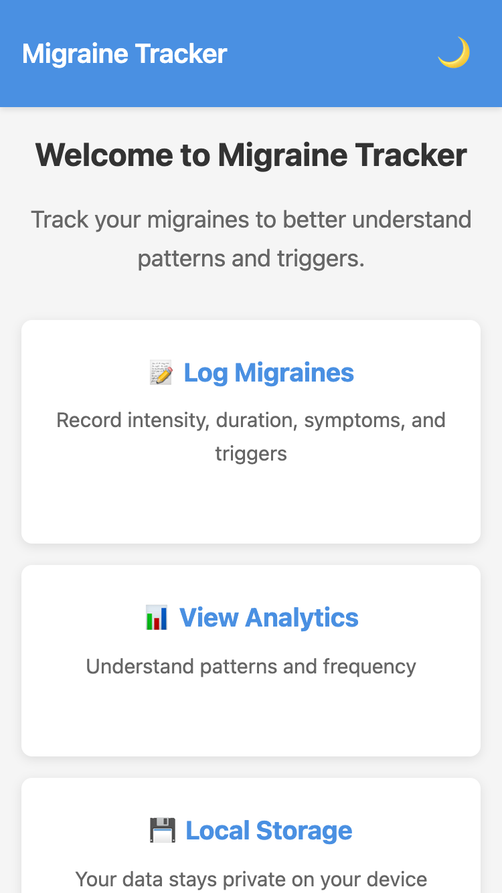

# Migraine Tracker - Development Milestones

## Overview
This document tracks the development progress of the Migraine Tracker application, documenting key milestones, screenshots, and completion dates.

---

## Milestone 1: Project Initialization ✅
**Date Completed:** June 27, 2025

### Achievements:
- Initialized npm project with React and Parcel
- Set up project directory structure
- Created basic React application
- Implemented dark mode toggle with localStorage persistence
- Added responsive design foundation
- Deployed to Firebase Hosting
- **Live URL:** https://real-migraines.web.app/

### Screenshots:

#### Light Mode:

#### Dark Mode:

#### Mobile View:

### Key Features Implemented:
- ✅ Dark/Light mode toggle
- ✅ Responsive layout
- ✅ Welcome page with feature overview
- ✅ Basic styling framework

### Technical Stack:
- React 19.1.0
- Parcel 2.15.4
- Vanilla CSS with CSS variables for theming

---

## Milestone 2: Authentication & Local Storage Service (Upcoming)
**Target Date:** Week 1

### Planned Features:
- [ ] Local storage service layer
- [ ] Data versioning system
- [ ] PIN/password authentication
- [ ] Session management
- [ ] Secure credential storage

### Technical Goals:
- Implement encryption for stored credentials
- Create data migration framework
- Build authentication context

---

## Milestone 3: Migraine Entry Management (Upcoming)
**Target Date:** Week 2

### Planned Features:
- [ ] Migraine entry form
- [ ] Date/time picker
- [ ] Pain intensity slider (1-10)
- [ ] Symptoms checklist
- [ ] Triggers checklist
- [ ] Entry CRUD operations
- [ ] Entry history view

### Technical Goals:
- Form validation
- Data persistence
- Edit/delete functionality

---

## Milestone 4: Dashboard & Analytics (Upcoming)
**Target Date:** Week 3

### Planned Features:
- [ ] Dashboard layout
- [ ] Total migraine count
- [ ] 7-day summary
- [ ] Recent entries list
- [ ] Monthly average statistics

### Technical Goals:
- Data aggregation functions
- Basic visualization

---

## Milestone 5: Data Export & Import (Upcoming)
**Target Date:** Week 3

### Planned Features:
- [ ] JSON export
- [ ] CSV export
- [ ] Data import functionality
- [ ] Backup/restore

### Technical Goals:
- File handling
- Data format validation

---

## Milestone 6: MVP Polish & Testing (Upcoming)
**Target Date:** Week 4

### Planned Features:
- [ ] Complete responsive testing
- [ ] Performance optimization
- [ ] Error handling improvements
- [ ] Loading states
- [ ] Empty states

### Technical Goals:
- Cross-browser testing
- Mobile device testing
- Local storage limit handling

---

## Future Phases

### Phase 2: Firebase Integration
- Cloud storage with Firestore
- Firebase Authentication
- Real-time sync
- Multi-device support

### Phase 3: Advanced Analytics
- Data visualization with charts
- Trigger correlation analysis
- Medication effectiveness tracking
- Weather integration

### Phase 4: Healthcare Integration
- PDF report generation
- Doctor-friendly summaries
- HIPAA compliance considerations

---

## Notes
- All dates are estimates and may be adjusted based on development progress
- MVP focuses on local storage to provide immediate value
- User feedback will guide feature prioritization for future phases