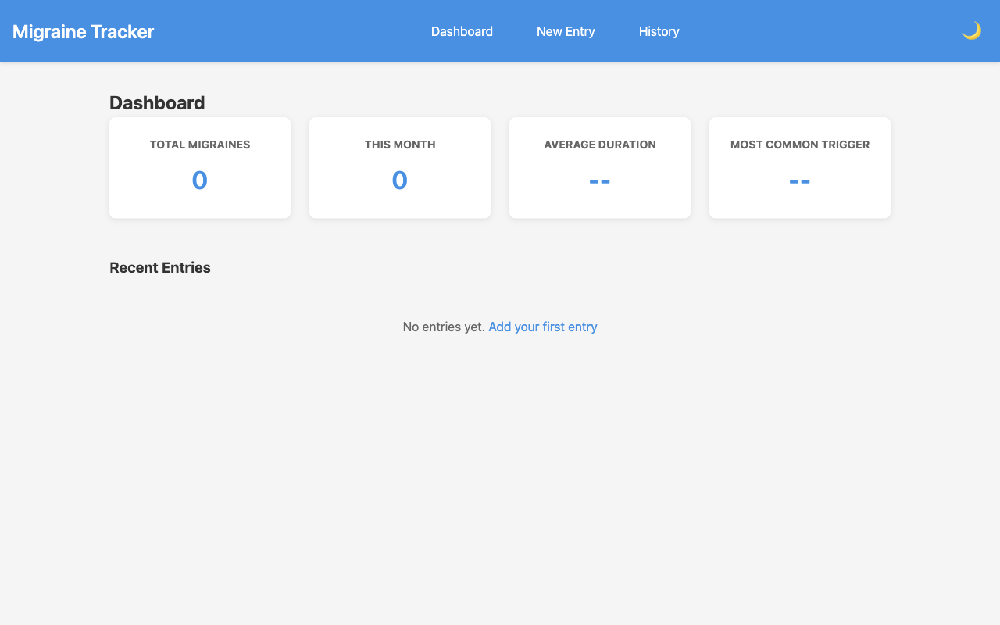
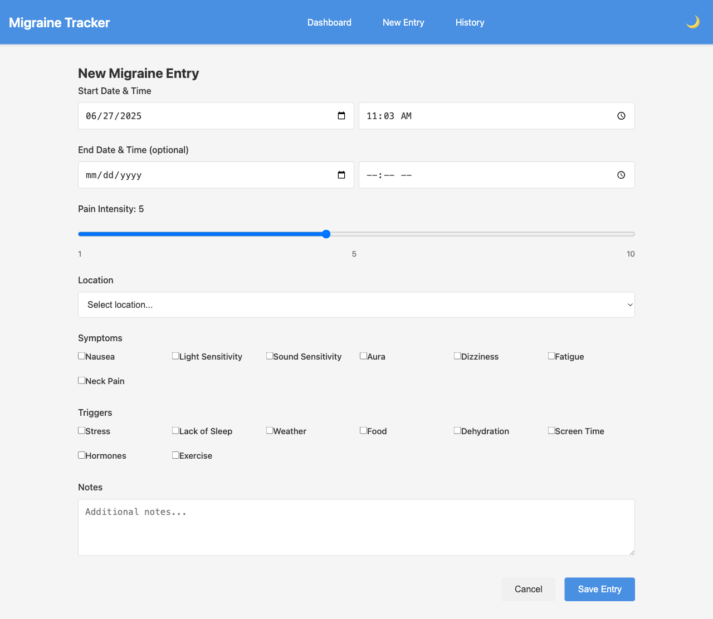
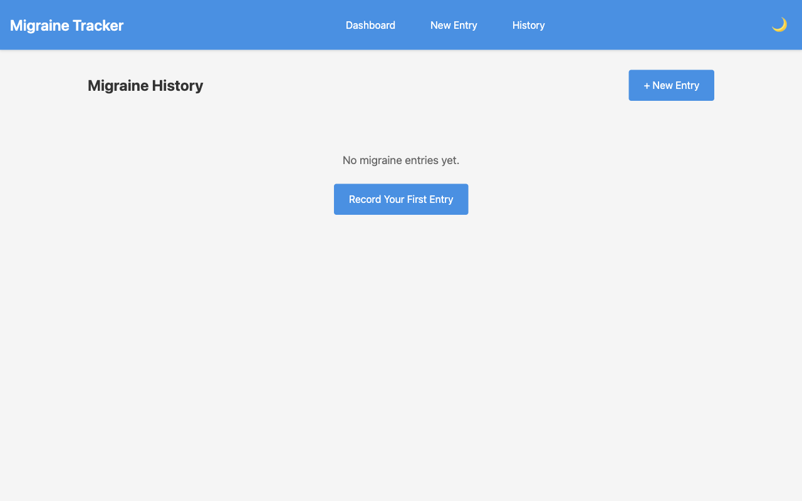
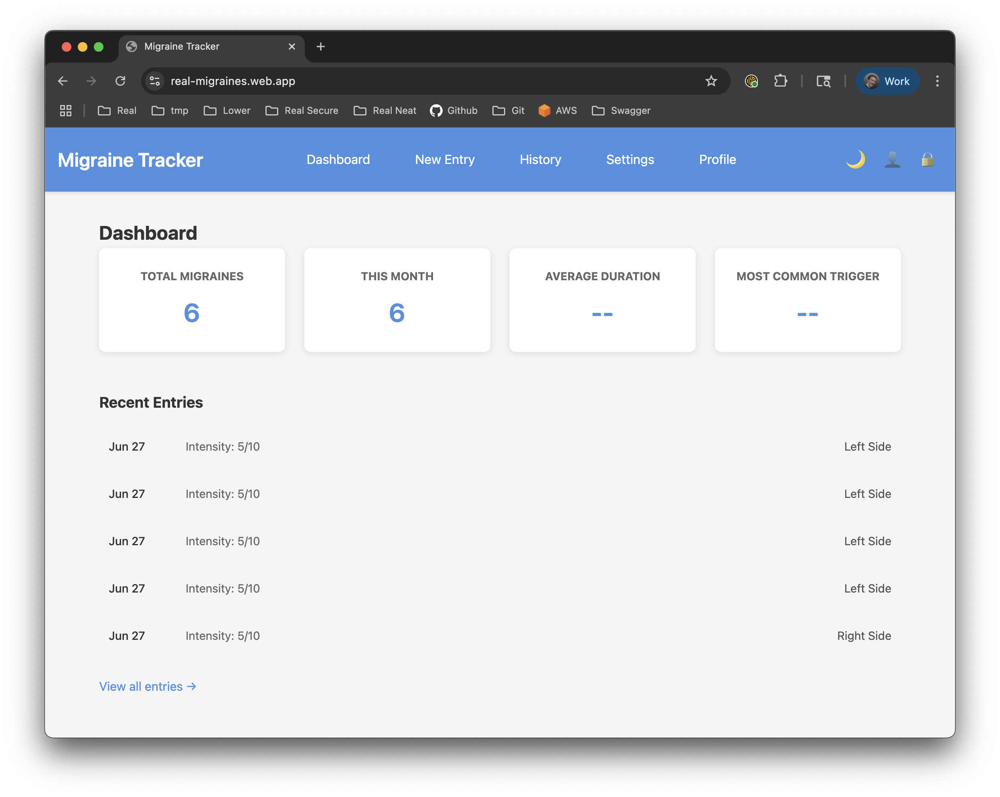
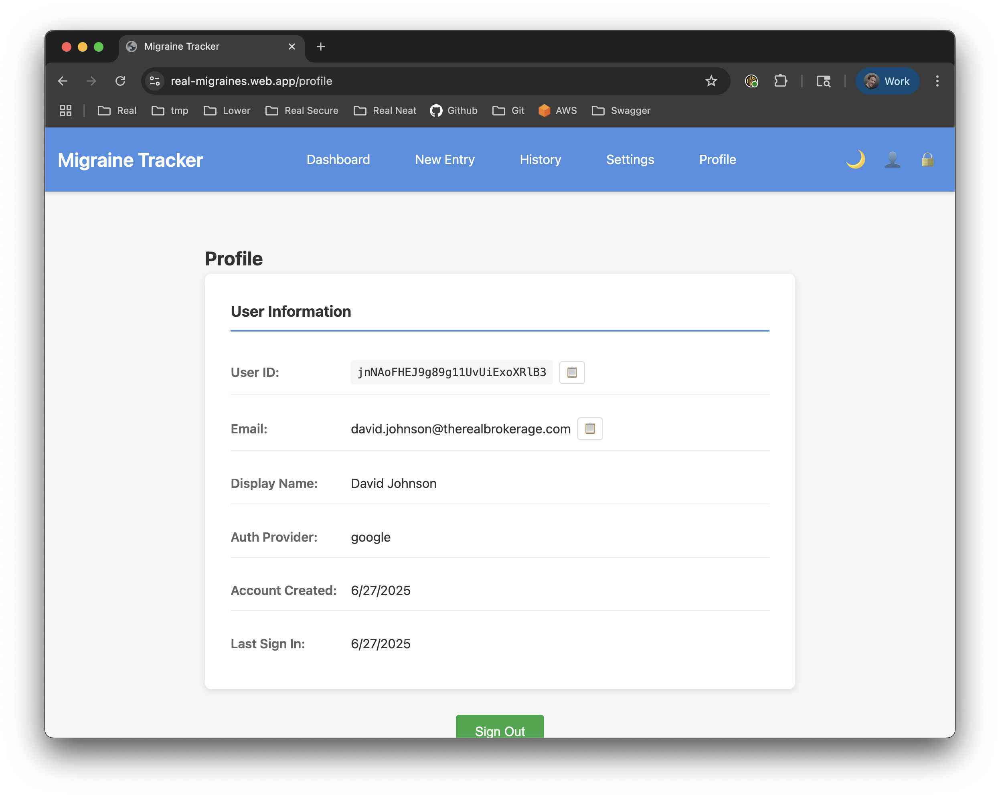
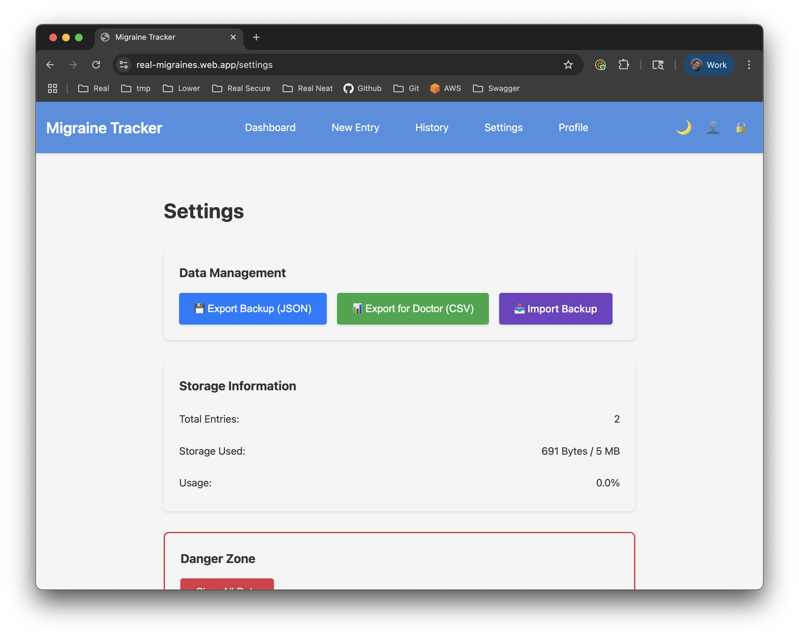
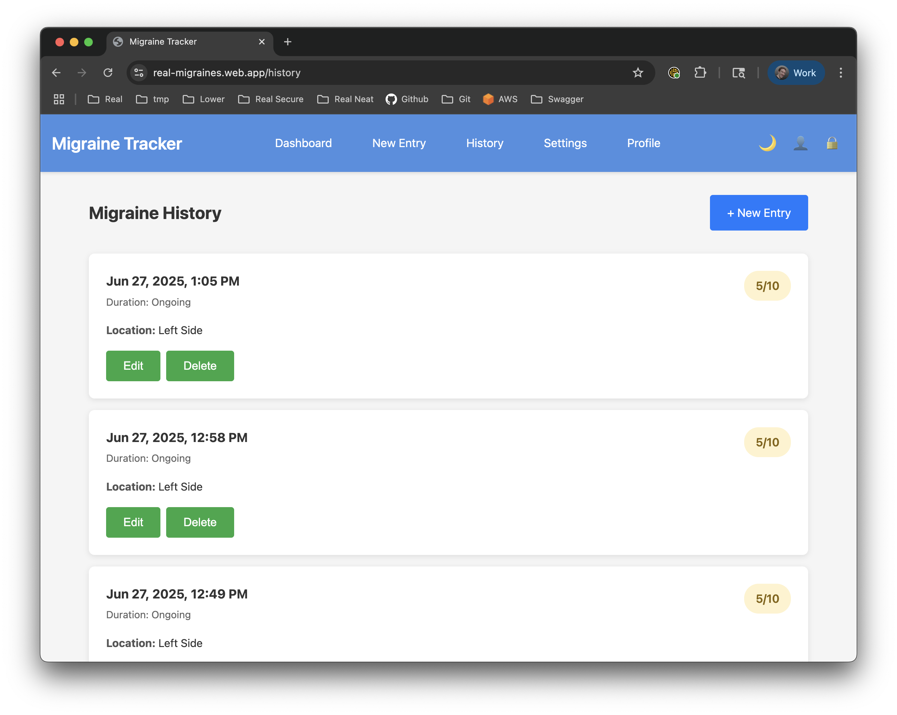

# Migraine Tracker - Development Milestones

## Overview
This document tracks the development progress of the Migraine Tracker application, documenting key milestones, screenshots, and completion dates.

---

## Milestone 1: Project Initialization ✅
**Date Completed:** June 27, 2025

### Achievements:
- Initialized npm project with React and Parcel
- Set up project directory structure
- Created basic React application
- Implemented dark mode toggle with localStorage persistence
- Added responsive design foundation
- Deployed to Firebase Hosting
- **Live URL:** https://real-migraines.web.app/

### Screenshots:

#### Light Mode:


#### Dark Mode:


#### Mobile View:


### Key Features Implemented:
- ✅ Dark/Light mode toggle
- ✅ Responsive layout
- ✅ Welcome page with feature overview
- ✅ Basic styling framework

### Technical Stack:
- React 19.1.0
- Parcel 2.15.4
- Vanilla CSS with CSS variables for theming

---

## Milestone 2: MVP Phase 1 - Functional Application ✅
**Date Completed:** June 27, 2025

### Achievements:
- ✅ Local storage service with data persistence
- ✅ PIN-based authentication system
- ✅ Complete migraine entry form with all fields
- ✅ History page with entry management
- ✅ Dashboard with real-time statistics
- ✅ Entry deletion functionality
- ✅ Dark mode support throughout
- ✅ Mobile responsive design

### Screenshots:

#### Dashboard:


Dashboard displays:
- Total migraine count
- This month's occurrences
- Average duration calculation
- Most common trigger identification
- Recent entries summary

#### New Entry Form:


The entry form includes:
- Date and time pickers for start/end
- Pain intensity slider (1-10)  
- Location dropdown
- Symptoms and triggers checklists
- Notes field for additional details

#### History Page:


History features:
- Chronological entry list
- Color-coded intensity badges
- Full entry details display
- Edit and delete actions
- Formatted dates and durations

### Key Features Implemented:
- ✅ Full CRUD operations for migraine entries
- ✅ Real-time statistics calculations
- ✅ Secure PIN authentication
- ✅ Data persistence with local storage
- ✅ Schema versioning for future migrations
- ✅ Intensity-based color coding
- ✅ Duration calculations
- ✅ Trigger and symptom tracking

### Technical Implementation:
- React with hooks for state management
- React Router for navigation
- Local storage service with encryption
- Responsive CSS with dark mode variables
- Form validation and error handling

### Data Model:
```javascript
{
  id: "timestamp-based-id",
  startDateTime: "2025-06-25T14:30",
  endDateTime: "2025-06-25T18:45",
  duration: 255, // minutes
  intensity: 7,
  location: "Left Side",
  symptoms: ["Nausea", "Light Sensitivity"],
  triggers: ["Stress", "Lack of Sleep"],
  notes: "Detailed description",
  createdAt: "ISO timestamp",
  updatedAt: "ISO timestamp"
}
```

---

## Phase 2 - Firebase Integration ✅
**Date Completed:** June 27, 2025

### Overview:
Successfully integrated Firebase services to transform the application from local-only storage to a cloud-enabled platform with real-time synchronization, user authentication, and secure data storage.

### Achievements:
- ✅ Firebase project setup and configuration
- ✅ Firebase Authentication with multiple providers
- ✅ Firestore database integration
- ✅ Real-time data synchronization
- ✅ Secure authentication flow
- ✅ User profile management
- ✅ Seamless migration from local storage
- ✅ Maintained backward compatibility

### Screenshots:

#### Firebase Login:


The enhanced authentication system supports:
- Email/password authentication
- Google Sign-In integration
- Password reset functionality
- Secure session management

#### Dashboard with Cloud Sync:


Cloud-enabled dashboard features:
- Real-time data synchronization
- User-specific data isolation
- Instant updates across devices
- Firestore-powered statistics

#### Profile Management:


New profile page displays:
- User authentication details
- Account creation date
- Last sign-in information
- Authentication provider type
- Sign out functionality

#### Settings with Firebase Status:


Settings page enhancements:
- Firebase connection status
- Cloud sync indicators
- Data management options
- Theme preferences synced to cloud

#### History with Firestore:


History improvements:
- Firestore-backed data storage
- Automatic timestamp conversion
- Optimized queries with indexes
- Offline persistence support

### Key Features Implemented:

#### Authentication System:
- ✅ Firebase Auth integration
- ✅ Email/password registration and login
- ✅ Google OAuth authentication
- ✅ Password reset via email
- ✅ Persistent login sessions
- ✅ Secure sign-out functionality

#### Firestore Database:
- ✅ NoSQL document structure
- ✅ User-specific data collections
- ✅ Real-time listeners
- ✅ Optimistic UI updates
- ✅ Automatic timestamp handling
- ✅ Security rules implementation

#### Data Migration:
- ✅ Local to Firestore format conversion
- ✅ Timestamp format compatibility
- ✅ Graceful fallback for offline mode
- ✅ Data integrity preservation

#### User Experience:
- ✅ Seamless authentication flow
- ✅ First-time user onboarding
- ✅ Loading states during sync
- ✅ Error handling and recovery
- ✅ Cross-device synchronization

### Technical Implementation:

#### Firebase Configuration:
```javascript
// Firebase services initialized:
- Authentication (Email/Password, Google)
- Firestore Database
- Firebase Hosting
- Security Rules
- Composite Indexes
```

#### Firestore Data Structure:
```javascript
// Users Collection
/users/{userId}/
{
  email: "user@example.com",
  displayName: "User Name",
  preferences: {
    theme: "dark",
    notifications: false
  },
  createdAt: Timestamp,
  updatedAt: Timestamp
}

// Migraines Collection
/migraines/{migraineId}/
{
  userId: "user-id",
  startDateTime: Timestamp,
  endDateTime: Timestamp,
  duration: 240,
  intensity: 7,
  location: "Right temple",
  symptoms: ["Nausea", "Light sensitivity"],
  triggers: ["Stress", "Weather"],
  notes: "Additional details",
  createdAt: Timestamp,
  updatedAt: Timestamp
}
```

#### Security Rules:
- Users can only access their own data
- Required fields validation
- Timestamp verification
- Authentication requirement

### Development Tools:
- Firebase Emulator Suite for local development
- Firestore indexes for optimized queries
- Admin SDK for data initialization
- Environment-based configuration

### Performance Improvements:
- Reduced local storage dependency
- Faster cross-device access
- Automatic data backup
- Scalable architecture

---

## Milestone 5: Data Export & Import (Upcoming)
**Target Date:** Week 3

### Planned Features:
- [ ] JSON export
- [ ] CSV export
- [ ] Data import functionality
- [ ] Backup/restore

### Technical Goals:
- File handling
- Data format validation

---

## Milestone 6: MVP Polish & Testing (Upcoming)
**Target Date:** Week 4

### Planned Features:
- [ ] Complete responsive testing
- [ ] Performance optimization
- [ ] Error handling improvements
- [ ] Loading states
- [ ] Empty states

### Technical Goals:
- Cross-browser testing
- Mobile device testing
- Local storage limit handling

---

## Future Phases

### Phase 3: Advanced Analytics
- Data visualization with charts
- Trigger correlation analysis
- Medication effectiveness tracking
- Weather integration

### Phase 4: Healthcare Integration
- PDF report generation
- Doctor-friendly summaries
- HIPAA compliance considerations

---

## Notes
- All dates are estimates and may be adjusted based on development progress
- MVP focuses on local storage to provide immediate value
- User feedback will guide feature prioritization for future phases